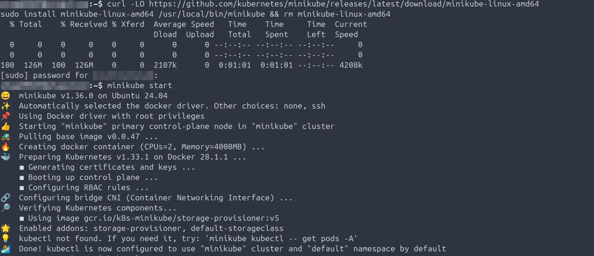

## Scope
This repo covers all projects, tasks, and troubleshooting in preperation for obtaining the KCNA. 

## Environment
- Kubernetes: v1.33.1
- kubectl: 1.33.4
- Operating System: Ubuntu 24.0.3 LTS
- YAML for manifest authoring and troubleshooting

```
├── README.md
├── Minikube
│   ├── Installation
|   |   └── Install Minikube locally
│   ├── Create, validate, destroy
|   |   └── Start cluster and Minikube version check
|   |   └── Stop the cluster
│   ├── Install, test and validate kubectl
|   |   └── Install kubectl, validate by checking cluster info, check locally installed version
│   ├── Troubleshooting
|   |   └── Troubleshoot and correct not starting; correct memory allocated
├── Docker
│   ├── Installation
|   |   └── Install Docker locally, confirm Hello World container launches and can SSH
│   ├── Version
|   |   └── Validate locally installed version
├── Pods & Manifests
│   ├── Pods
|   |   └── Manual creation, deletion and validation 
│   ├── Manifests
|   |   └── Creation and review for YAML syntax errors
│   ├── Troubleshooting
|   |   └── Troubleshoot and correct issues related to restart loops, incorrect image in manifest, incorrect image version in manifest
│   ├── Manifest pod creation
|   |   └── Create manifest then start pods
|   |   └── Review details of pods after confirming running
|   |   └── Delete pods and confirm gone
```
## Minikube
- 08122025 Install Minikube.
  
- 08122025 Start cluster and Minikube version check.
  
- 08122025 Validate cluster is running, stop the cluster, then delete.
  
- 08142025 Install kubectl, start the cluster, check thje cluster info, check the kubectl version.
  
- 08162025 Determine Minikube is not launching because it is not started, and when it is starting starting with too much memory allocated.
  
- 08162025 Fix Minikube not starting, reduce memory allocation create pod, create nginx pod.
  

## Docker
- 08132025 Install Docker and Launch Hello World container.
  
- 08132025 Validate locally installed Docker version.
  

## Pods & Manifests
- 08162025 Validate running pods on the node and then review pod details.
  
- 08162025 Delete the pod and confirm it is no longer running on the node.
  
- 08162025 Create manifest then validate both spacing and contents are correct.
  
- 08162025 Troubleshooting of pods not starting due to being in a crash loop.
  
- 08162025 Troubleshooting of the wrong image being defined in the manifest.
  
  - 08162025 Troubleshooting of the incorrect image version being defined in the manifest.
  
  - 08162025 Describe running pods and review applicable details, speficially start process for all three.
  
  - 08162025 Create manifest for all three pods, start them, confirm 3/3 are now running on the node.
  
  - 08162025 Delete all three pods then validate they are gone on the node.
  

  
